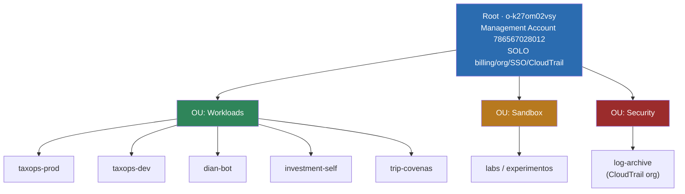
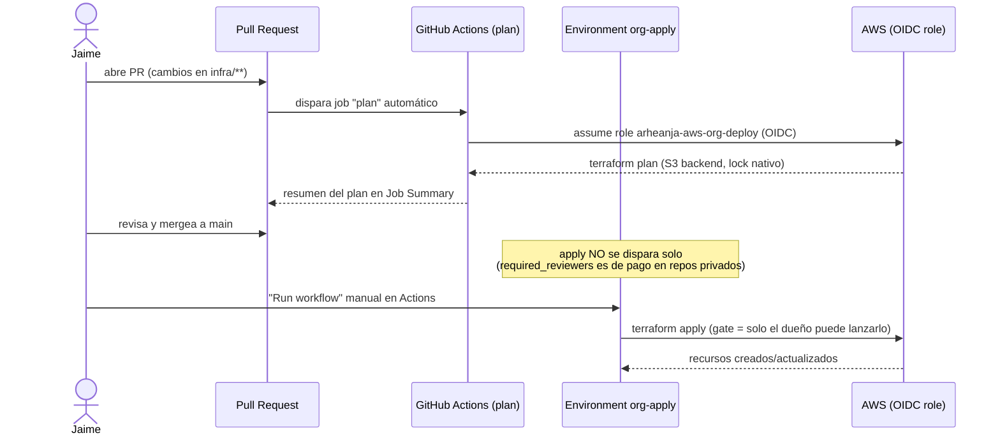

# arheanja-aws-org

Landing zone: gobernanza de la **organización AWS multi-cuenta** (OUs, SCPs,
cuentas, SSO). Repo padre transversal a todos los proyectos.

**Premisa: todo gratis.** Organizations, OUs, SCPs, SSO y cuentas no cuestan.

## Arquitectura objetivo (org)



> Estado real (2026-09-16): las 3 OUs están **validadas por `terraform plan`**
> pero no aplicadas todavía. Las cuentas hijas (`taxops-prod`, `dian-bot`, …)
> son la Fase 2, ninguna existe aún — hoy todo corre mezclado en la
> management account.

## CI/CD — flujo real



## Estructura
```
infra/
  main.tf           backend (S3, locking nativo) + provider
  organization.tf   OUs (Workloads, Sandbox, Security)
  variables.tf      emails de cuentas (alias + de Gmail)
scripts/            plan, apply, aws-login, gh-login
.github/workflows/  terraform.yml (plan en PR, apply manual)
GMAIL-Y-EMAILS.md   guía de labels/filtros para los alias de correo
CHANGELOG.md        bitácora de cambios de infraestructura/gobernanza
```

## Uso local
```bash
cp .envrc.example .envrc && direnv allow
./scripts/aws-login.sh
./scripts/plan.sh          # revisar antes de aplicar
```

## CI/CD
- **PR** → `terraform plan` (resumen en el Job Summary).
- **Apply** → manual, botón "Run workflow" en Actions (`workflow_dispatch`).
  `required reviewers` en environments es feature paga de GitHub para repos
  privados, así que el gate real es que solo tú puedes lanzar ese botón.
- Deploy por **OIDC** (rol `arheanja-aws-org-deploy`), sin llaves.

## Estado actual (2026-09-16)
- **Fase 0 completa**: emails alias definidos, repo publicado, MFA en root
  confirmado (`AccountMFAEnabled=1`).
- **Fase 1 aplicada**: OUs creadas en la org real `o-k27om02vsy` (raíz
  `r-j9f1`) — `Workloads` (`ou-j9f1-gxoo9kci`), `Sandbox`
  (`ou-j9f1-o7twnsfh`), `Security` (`ou-j9f1-ueol9xss`). Costo: $0.
- State: S3 `awsorg-tfstate-786567028012`, key `organization/`, **locking
  nativo de S3** (`use_lockfile`, no DynamoDB — migrado desde el diseño
  original que usaba `awsorg-tflock`).
- Repo movido de `~/arheanja/arheanja-aws-org` a
  `personal-projects/arheanja-aws-org` para heredar aislamiento de
  credenciales (`.gitconfig-personal` + direnv de `personal-projects/`).
- Detalle completo de incidentes y decisiones: ver `CHANGELOG.md`.

## Roadmap
Ver `DIAN-bot/docs/AWS-ORG-PLAN.md`: SCPs, cuentas por proyecto, migración
(DIAN-bot piloto → … → TaxOps), seguridad. Todo gratis.
